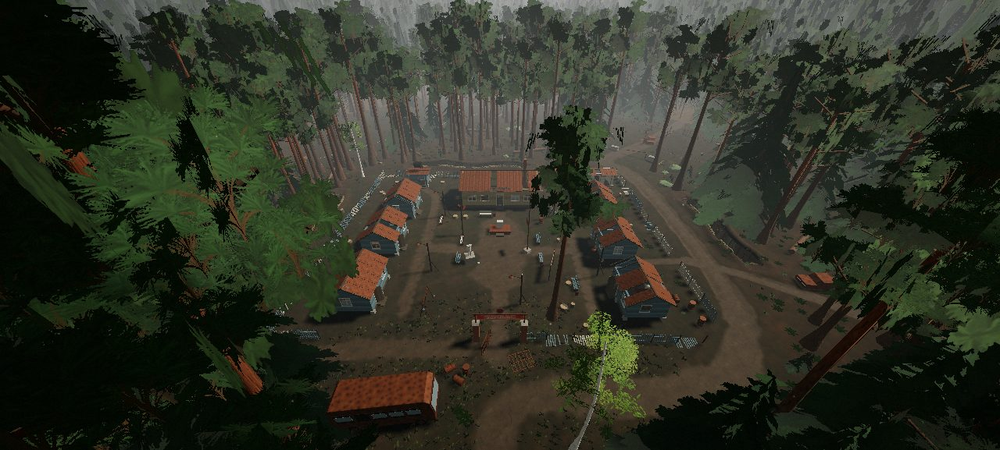
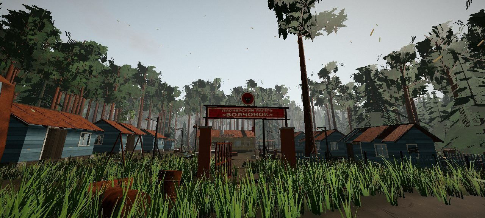
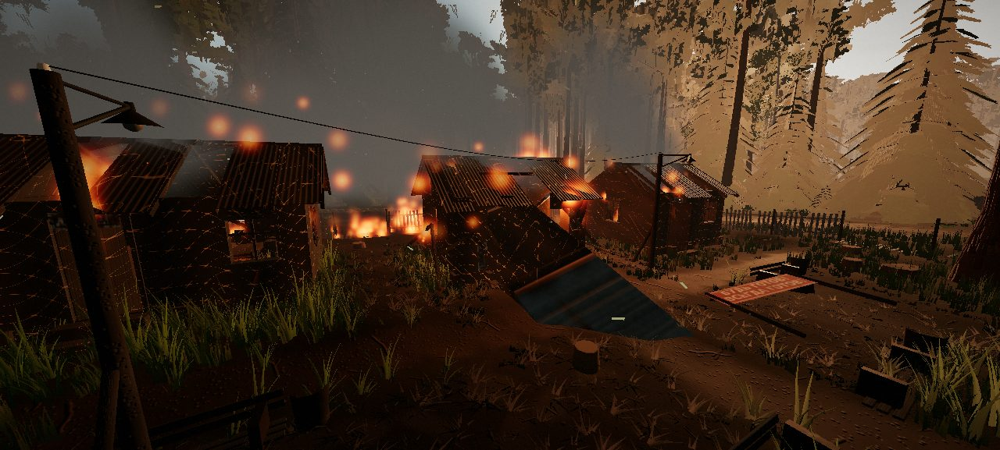
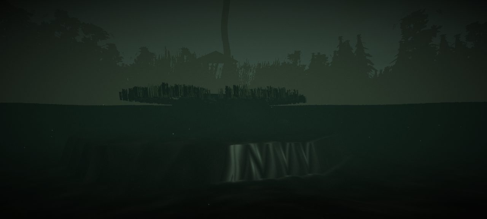
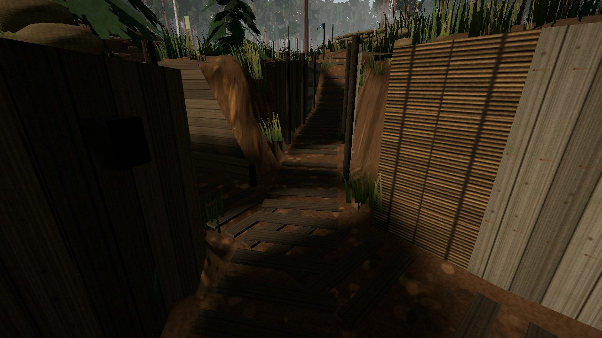
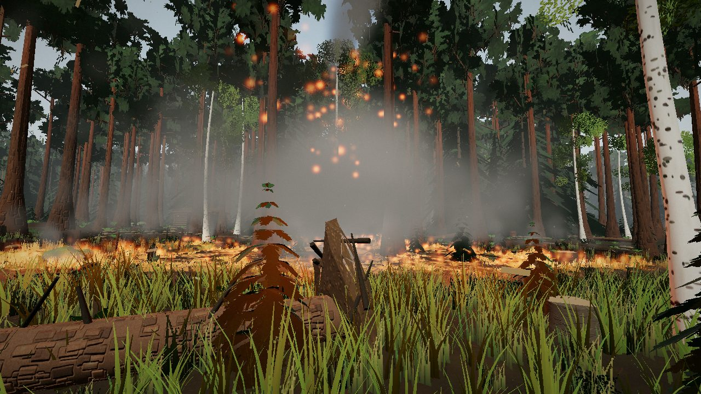
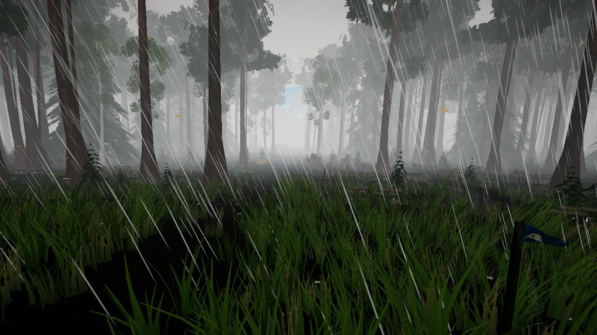
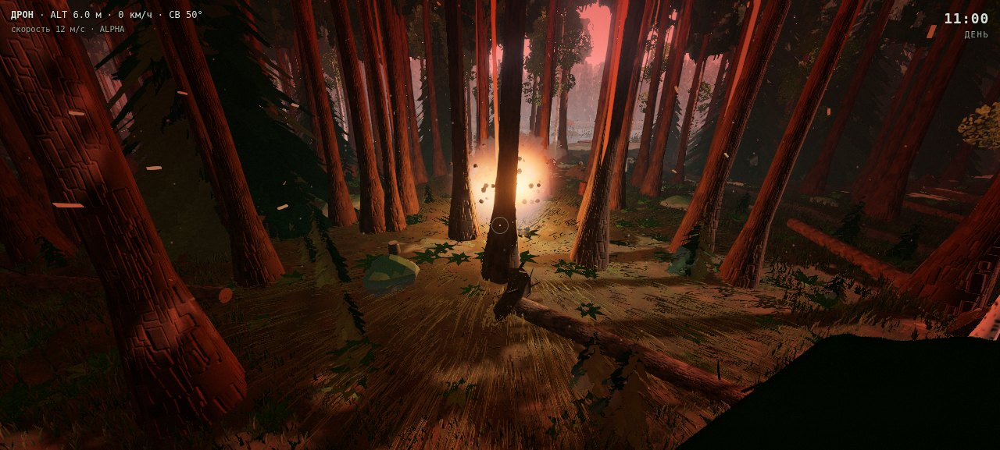
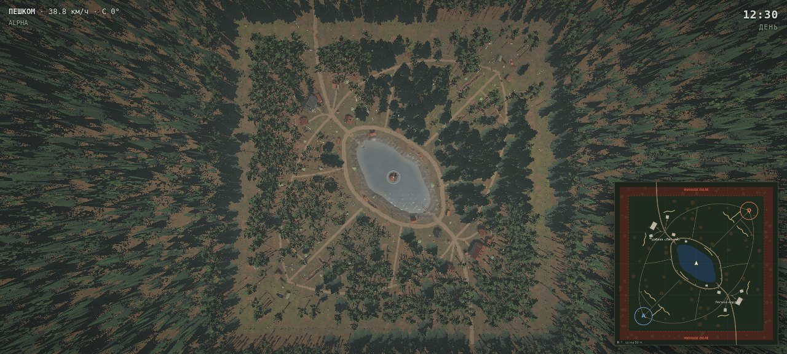

# ТИХИЙ БОР · Forest Front

Лесная карта для шутера на three.js. Здания здесь не главные: весь бой идёт в хвойном лесу.
Заброшенная турбаза у лесного озера оказалась на линии фронта. Вокруг окопы, пустые срубы,
ржавые машины и бочки, по периметру — минное поле. Всё рисуется кодом: процедурные текстуры,
синтезированный звук, без внешних ассетов (с CDN грузится только three.js).













## Запуск

| Вариант | Как |
|---|---|
| Один файл | Открыть `dist/tikhiy_bor.html` двойным щелчком (нужен интернет для three.js с unpkg) |
| Из исходников | `python3 -m http.server 8080` в корне → `http://localhost:8080/` |
| Качество | Кнопки на стартовом экране или `?q=potato / low / medium / high` (`potato` — для слабых ПК) |
| Сборка | `npm install && npm run build` → `dist/tikhiy_bor.html` (ammo.js и его wasm встроены в файл) |
| Погода сразу | `?weather=clear / cloudy / rain / storm` или кнопки на стартовом экране |
| Проверка плана | `npm run check`: симметрия, базы, озеро, окопы, минное поле |

## Управление

Камера по умолчанию — **дрон-призрак**: свободный полёт сквозь кроны и постройки. Ниже 0.4 м
над землёй или водой опуститься нельзя. Есть инерция и крен на поворотах.

| Клавиша | Действие |
|---|---|
| Мышь | обзор |
| W A S D | полёт по направлению взгляда / ходьба |
| Space / E, C / Q | вверх / вниз (пешком: прыжок / присесть) |
| Shift, колесо | быстрее; скорость дрона 2–60 м/с |
| ЛКМ | сброс гранаты с дрона / бросок пешком |
| ПКМ | выстрел (луч ammo.js: стекло, щепа, импульс телам) |
| B | артналёт: 5 снарядов по точке прицела |
| K, J | смена погоды, удар молнии |
| G | дрон ⇄ пешком (коллизии, окопы, вброд и вплавь) |
| F | прожектор дрона / фонарь |
| M | тактическая карта |
| P | кинематографичный облёт карты (WASD — прервать) |
| R | вернуться на базу |
| N, 1–4, T, [ ] | фаза суток, утро/день/закат/ночь, пауза, скорость времени |
| U, V, H, F3 | звук, скрыть интерфейс, подсказки, статистика |

## Логика карты

```
            С (−z)
   ┌──────── МИННОЕ ПОЛЕ ────────┐
   │  Турбаза        ░░░░    [D] │   A — Alpha, юго-запад (−84, 84)
   │    ▪▪  ▪        ░░░░  ≈≈≈   │   D — Delta, северо-восток (84, −84)
   │   ▪  ▪   ╭──кольцо──╮  ≈≈   │   ≈ — передний рубеж (окопы)
 З │        ╭─╯  ОЗЕРО  ╰─╮     │ В
   │        ╰─╮   (о)    ╭─╯    │   (о) — остров с беседкой
   │   ≈≈     ╰──────────╯  ▪ ▪ │   ▪ — постройки
   │ ≈≈≈  ░░░░        ▪  ▪      │
   │ [A]  ░░░░        «Волчонок»│
   └──────── МИННОЕ ПОЛЕ ────────┘
            Ю (+z)
```

- **Симметрия.** Карта центрально-симметрична: (x, z) → (−x, −z). Рельеф, плотность леса,
  тропы, окопы, воронки, машины, бревна и валуны у Alpha и Delta одинаковые. Отличаются
  только облики построек: турбаза против пионерлагеря «Волчонок». Габариты
  при этом близки. `npm run check` проверяет симметрию рельефа вне турбазы и лагеря.
- **Базы (респауны).** A и D стоят в противоположных углах на пригорках, в 24 м от минного
  поля: с тыла не зайти. На каждой базе флаг команды 5.6×3.5 м на 13-метровой мачте
  (ткань Верле), ДЗОТ, мешки полукругом, склад под маскировочной сетью, генератор с
  прожекторами, бочка-костёр, палатка. Границу зоны возрождения отмечают колышки с вымпелами.
- **Озеро** вытянуто поперёк оси A–D и закрывает лобовой прострел между базами (проверяется
  в `check`). Поэтому бой расходится на три линии: западный и восточный фланги (выходят к
  турбазе и лагерю) и берег. У берега камыши с рогозом, кувшинки, мостки с лодкой, в центре
  остров со старой сосной и остовом беседки.
- **Окопы.** Передний рубеж каждой базы — зигзаг с траверсами через 5 м, разрывом под
  центральную тропу, ходом сообщения к базе и блиндажом на крыле. Ещё есть береговые ячейки
  старые траншеи у турбазы и окопы вокруг лагеря. Стены обшиты досками, на дне трап, на бруствере
  со стороны противника мешки. Выбраться можно только по пологим аппарелям на концах.
- **Укрытия.** Ржавые «копейки», «буханки», автобус, грузовик, перевёрнутая и сгоревшая
  машины. Бочки подбрасывает взрывом. Ещё укрывают поваленные стволы с корневыми
  выворотами, пни, валуны, поленницы и подрост ёлок: он скрывает от взгляда, но не от пули.
- **Дома.** Срубы и дощатые домики, в которые можно войти: выбитые окна, сорванные двери,
  дырявая кровля, печь, опрокинутый стол. В паре окон ночью теплится свеча.
- **Минное поле** занимает полосу 108–122 м по всему периметру: мины через 2.6 м, растяжки
  ОЗМ, часть ТМ-62 и ПМН вымыта из грунта. Внутреннюю границу обозначают колья с красно-белой
  лентой и таблички «МИНЫ»/«СТОЙ!», внешнюю — колючая проволока и спираль. Шаг на полосу
  означает подрыв и возрождение на своей базе через 3 с. Дрон на бреющем (ниже 1.8 м) цепляет
  растяжку. Старые дороги упираются в поле: разбитые блокпосты, ежи, сгоревшая машина.
- **Свет.** Сутки идут по кругу: утро → день → закат → сумерки → ночь → рассвет, в среднем
  18 минут. Солнце восходит на северо-востоке, заходит на северо-западе. Ночью светит только
  сеть фонарей турбазы: кольцевая, аллеи, мостки, база. Часть ламп разбита, часть моргает.
  Фланги и окопы остаются во тьме, их освещает луна. Лавочки и урны стоят у фонарей.
- **Физика и атмосфера.** Ветер с порывами качает кроны, траву, камыш, ленты и ткань.
  Взрыв посылает по растительности, флагам и бочкам ударную волну, звук приходит с задержкой
  по скорости звука. С крон падает хвоя, в лучах висит пыль, к ночи и на рассвете над озером
  встаёт туман. Слышны птицы, сверчки, сова и далёкая канонада.

## Пионерлагерь «Волчонок»

Вместо кордона на юго-восточном конце озера — заброшенный пионерлагерь. Штакетник с
проломами и поваленными секциями, ворота с аркой «ПИОНЕРСКИЙ ЛАГЕРЬ «ВОЛЧОНОК»» и значком
с волчонком, у ворот ржавый автобус. Внутри: линейка с флагштоком и обрывком красного флага,
трибуна, гипсовый горнист без головы (голова лежит рядом), доска «БУДЬ ГОТОВ! — ВСЕГДА
ГОТОВ!», громкоговоритель, качели на одной цепи, шесть отрядных корпусов с железными
кроватями, столовая с длинными столами, умывальник с кранами и осколком зеркала, душ с баком
на крыше, туалеты «М»/«Ж», лавочки. Территорию вырубили: пни, редкие сосны, высокая трава.
Дорожки: центральная аллея, линейка, боковые аллеи, к столовой, туалетам, калитке. Фонари
на аллеях мерцают бледно-жёлтым, гаснут на секунды и вспыхивают. За забором — окопы.
Турбаза на другой стороне озера не зеркалится и осталась прежней.

## Коллизии

Дрон больше не проходит сквозь мир: стволы, стены, кровли (ступенчатый коллайдер конька),
блиндажи (накат и насыпь), машины, заборы, целые стёкла. Он упирается и скользит вдоль
препятствия, от удара трясёт камеру, на скорости дрон бьёт стекло. Сквозь хвою пролетает
с торможением, хвоя осыпается. Пешком — то же плюс окопы. Машины ставятся только туда, где
под кузовом нет окопа, дома или воды. `MAP_API.validate()` проверяет раскладку: машины
в окопах и домах, постройки в окопах, деревья в домах (сейчас — ноль нарушений).

## Вода

В озеро можно зайти: вброд (круги и брызги от ног), вплавь, нырнуть (C — вниз, Space —
вверх), воздуха на 25 с. Дрон тоже уходит под воду, там его медленно выносит вверх.
Под водой торфяная муть, колыхание картинки, глухой звук, снизу видна поверхность с окном
неба, на дне у берега пляшут блики. Тела плавают по плотности: доски, ветки, щепа и бочки
держатся на воде и качаются, их сносит ветром; жесть, стекло и комья тонут медленно.
Упавшее в воду даёт всплеск и круги. В дождь по глади бегут кольца от капель.

## Разрушение и пожар построек

Дома, блиндажи, веранда, туалеты, заборы, лавки, ворота, статуя собраны из панелей.
Взрыв бьёт по панелям с затуханием: сруб держит лучше досок, кровля и двери слабее.
Стена рассыпается на брёвна или доски (тела), дверь, лист кровли, мебель, секция забора
улетают целиком. Кровля держится на стенах: выбито больше половины — проваливается, и её
коллайдер снимается. Наличники и углы держатся на соседних кусках, фронтон — на своей стене,
бак душа — на кровле. Проходящая ударная волна встряхивает постройки. Дом загорается от
взрыва рядом, горящей травы, упавшей головни, молнии. Огонь разгорается, рвётся из окон и дыр
кровли, стены чернеют и тлеют трещинами, панели выгорают и обрушиваются, остаются остов и
печная труба. Огонь перекидывается на траву и соседние дома, дождь его сбивает. В горящем
доме можно сгореть. Выстрел по двери или доске копит урон.

## Слабые ПК

Пресет «минимальное» (`?q=potato`, выбирается сам при ≤2 ядрах или ≤2 ГБ): рендер ×0.75,
тени 512 раз в 3 кадра, без блума, SMAA, отражений и травинок, меньше травы, деревьев,
частиц, дождя, тел. Динамическое разрешение на всех пресетах: если кадр дольше ~36 мс,
разрешение снижается до ×0.55, при запасе возвращается. При просадке урезаются бюджеты
обломков и тел, дальние обломки живут вдвое меньше. Замер в песочнице (программный рендер):
«минимальное» — 304 вызова отрисовки и 1.1 млн треугольников на кадр против 808 и 7.7 млн на
«высоком»; логика кадра — 1.6 мс в покое и 3–6 мс в бою.

## Окопы

38 участков (было 12; 10 из них — у озера, в насыпи: дно выше воды, вал выше обычного): передний рубеж с зигзагом, вторая линия дугой вокруг базы, сапы с
пулемётными ячейками, фланговая позиция у западной тропы, окоп поперёк центральной тропы,
береговые ячейки, старые траншеи у турбазы. Линия, пересекающая тропу, рвётся сама — у тропы
выход-аппарель. Конец, упирающийся в другой окоп, остаётся открытым (стык без стенок).

- **Обшивка** строится по смещённым от оси ломаным со скосом на изгибах: доски не заходят в
  проход и не оставляют щелей. Панели по 1.2–2.6 м: вертикальные и горизонтальные доски,
  тёмные и светлые, плетень. Сверху — доска-обвязка до грунта.
- **Коллайдеры** — те же отрезки, толщиной 0.32 м за обшивкой, внахлёст. За доски не пройти
  ни на прямых, ни на изгибах, ни на аппарелях (проверено автотестом: 480 попыток «выйти в стену»).
- Ровное дно на 0.8 м от оси, глубина 1.8 м (стоя не видно), ступени для стрельбы со стороны
  противника (с них видно поверх бруствера), настил-трап, мешки на бруствере, фонари на тыльной
  стенке (горят ночью, часть разбита), занавешенные «лисьи норы», колючка перед рубежом.
- Блиндаж в конце окопа стоит за аппарелью, вход смотрит в окоп — проход больше не перекрыт.
- Дно окопов, воронок и низин затенено (запечённое затенение рельефа).

## Физика (ammo.js)

Bullet в WebAssembly (`lib/ammo`, из присланного архива). Статический мир: карта высот рельефа
(та же, по которой ходит игрок) и все 3500 коллайдеров карты. Динамика: бочки, комья земли,
щепа, ветки, осколки стекла, падающие деревья. Игрок — кинематическая капсула, расталкивает
обломки. Тела засыпают и уходят в землю по истечении жизни, число ограничено по качеству.
Если wasm не загрузился, карта работает с упрощённой физикой.

## Разрушения

- **Воронки** проседают по-настоящему: меняется сетка земли, кэш высот и карта высот физики.
  В воронке копоть, выбитая трава, в дождь — лужа. Повторное попадание углубляет воронку.
- **Ударная волна**: вспышка-сфера, кольцо пыли, импульс всем телам, отброс игрока, вплотную —
  гибель; трава и кроны качаются волной (как раньше).
- **Деревья** ломаются по-разному: слабая волна обрывает ветки (падают телами, часть горит),
  сильная ломает ствол — остаётся расщеплённый пень со свежим сколом, верхушка валится по
  физике от взрыва, может зависнуть на соседях и остаётся препятствием. Ближние кроны горят
  и обугливаются. Молния бьёт в высокое дерево: расщеп или пожар в кроне.
- **Стёкла** в домах турбазы и в машинах бьются взрывом с задержкой по скорости звука и
  пулей; осколки — тела со звоном.
- **Огонь**: клеточный пожар на сетке 1 м. Горит трава и хвойная подстилка, по ветру быстрее;
  сухой луг прогорает полосой, лесная подстилка гаснет сама. Горящие ветки поджигают траву,
  куда упали. Трава и подлесок в гари оседают и чернеют, земля покрыта копотью с тлеющими
  углями. Свет от очагов, дым, искры, треск. Дождь гасит огонь, мокрая трава не горит.
  В огне можно сгореть.

## Погода

Ясно → пасмурно → дождь → гроза, меняется сама раз в несколько минут (K — вручную).
Дождь — штрихи на GPU с наклоном по ветру, не проходят сквозь землю, всплески на земле, шум.
Намокание копится и сохнет: земля темнеет, в колеях, низинах, воронках и на дне окопов встают
лужи с кольцами от капель, дерево и металл блестят. Небо затягивает, туман гуще, ветер сильнее.
Гроза: ветвящиеся разряды, вспышка на весь лес, гром с задержкой. Следы подошв остаются на
тропах и в грязи, в дождь — глубже; мокрый шаг чавкает.

## Трава

Вблизи — геометрические травинки (изогнутые ленты, тёмные у корня, сухие кончики), дальше —
карточки. Приминается игроком, качается ветром и ударной волной, оседает и чернеет в гари,
светится в огне, темнеет и блестит под дождём. В окопах трава не растёт.

## Код

| Файл | Что внутри |
|---|---|
| [`src/world/layout.js`](src/world/layout.js) | план карты: базы, озеро, тропы, окопы, воронки, рельеф |
| [`src/world/forest.js`](src/world/forest.js) | ели, сосны, берёзы (LOD), дальний лес |
| [`src/world/groundcover.js`](src/world/groundcover.js) | трава вокруг камеры, папоротник, черничник, подрост |
| [`src/world/lake.js`](src/world/lake.js) | вода с отражением, камыш, кувшинки, мостки, остров |
| [`src/world/military.js`](src/world/military.js) | окопы, базы, флаги, блиндажи, минное поле |
| [`src/world/buildings.js`](src/world/buildings.js) | срубы, корпус турбазы, баня (разрушаемые) |
| [`src/world/vehicles.js`](src/world/vehicles.js), [`props.js`](src/world/props.js) | ржавая техника, бочки с физикой, бревна, валуны |
| [`src/world/lamps.js`](src/world/lamps.js) | фонари, пятна света, пул источников |
| [`src/world/sky.js`](src/world/sky.js) | цикл суток, солнце/луна, звёзды, облака, туман |
| [`src/world/cloth.js`](src/world/cloth.js), [`wind.js`](src/world/wind.js) | ткань, ветер и ударная волна в шейдерах |
| [`src/core/physics.js`](src/core/physics.js) | ammo.js: статический мир, тела, лучи, капсула игрока |
| [`src/fx/destruction.js`](src/fx/destruction.js) | воронки, обломки, ветки, излом деревьев, ударная волна |
| [`src/fx/structures.js`](src/fx/structures.js) | разрушение и пожар построек по панелям, опоры, обугливание |
| [`src/world/camp.js`](src/world/camp.js) | пионерлагерь «Волчонок» |
| [`src/fx/fire.js`](src/fx/fire.js) | клеточный пожар, горящие кроны и ветки, свет очагов |
| [`src/fx/glass.js`](src/fx/glass.js) | бьющиеся стёкла и осколки |
| [`src/world/weather.js`](src/world/weather.js) | дождь, гроза, молнии, намокание |
| [`src/fx/footprints.js`](src/fx/footprints.js), [`src/game/weapons.js`](src/game/weapons.js) | следы; выстрел и артналёт |
| [`src/fx/`](src/fx) | частицы, взрывы, синтез звука, пост-обработка |
| [`src/game/`](src/game) | дрон, пеший режим, мины, облёт, интерфейс |
